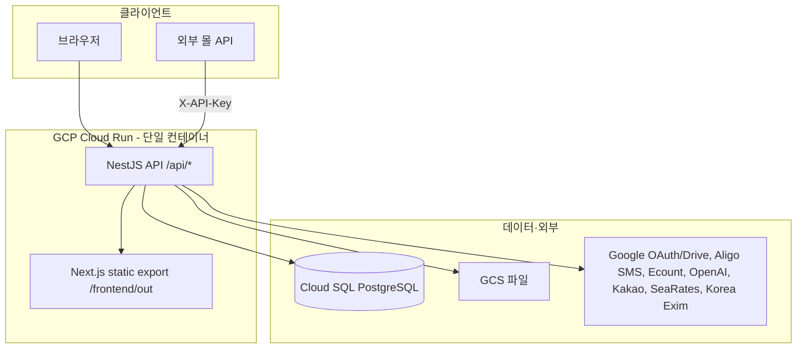

# CCBio ERP — 개발 인수인계 문서

CCBio(참참바이오) 내부 업무용 ERP입니다. 무역·입고·재고·판매·배송·수금·상담·고객 등 **수입 사료/원료 무역부터 판매·물류·회계 연동**까지 한 시스템에서 처리합니다.

> **참고:** 루트 `README.md`는 초기 버전 기준입니다(Next 14, `erp`/`farm` 모듈 등). 실제 코드와 다르므로 **이 문서와 코드를 기준**으로 보세요.

---

## 1. 시스템 아키텍처



| 구분 | 내용 |
|------|------|
| **배포 형태** | Docker 멀티스테이지 빌드 → **NestJS가 API + 정적 프론트 동시 서빙** |
| **프론트** | Next.js **static export** (`output: 'export'`) — SSR/미들웨어 없음, 데이터는 전부 클라이언트 |
| **API** | `/api/*` prefix, Swagger: `/api/docs` |
| **프로덕션** | GCP Cloud Run (`asia-northeast3`), Cloud SQL, 커스텀 도메인 `erp.ccbio.co.kr` |
| **패키지 매니저** | Yarn 1.x |

---

## 2. 기술 스택 (실제 버전)

| 영역 | 기술 |
|------|------|
| Backend | NestJS 10, TypeORM 0.3, PostgreSQL, Passport JWT + Google OAuth |
| Frontend | **Next.js 16**, React 19, TypeScript 5 |
| UI | shadcn/ui (Radix), Tailwind CSS v4, TanStack Table/Query |
| 인증 | JWT (쿠키 `ccbio_erp_token`, 7일) |
| 상태 | React Query (서버), react-hook-form (폼), Redux/Zustand 없음 |

---

## 3. 저장소 구조

```
ccbio_erp/
├── backend/                 # NestJS API
│   ├── src/
│   │   ├── main.ts          # CORS, ValidationPipe, static serve, Swagger
│   │   ├── app.module.ts    # 모듈 등록 (SalesDelivery가 Sales보다 먼저)
│   │   └── modules/         # 도메인별 모듈 (~35개)
│   ├── .env.example
│   └── docs/                # 인벤토리, 외부 API, Ecount 등 상세 문서
├── frontend/
│   ├── app/                 # App Router 페이지 (~99 routes)
│   ├── components/          # ui/, layout/, 도메인별 폴더
│   └── lib/
│       ├── api.ts           # axios + JWT + 401 처리
│       ├── auth.ts
│       └── hooks/           # use-*.ts (React Query, ~48개)
├── Dockerfile               # frontend build → backend build → runtime
├── deploy.sh                # Cloud Run 배포
└── deploy-cloud-run.sh      # (별도 배포 스크립트)
```

---

## 4. 비즈니스 도메인 맵

ERP는 크게 **무역(수입)** → **입고·재고** → **판매·배송** → **재무(수금·결제)** 흐름으로 이어집니다.

### 4.1 무역·물류 (Trade / Logistics)

| 화면 경로 | 역할 |
|-----------|------|
| `/trade/order`, `/trade/management`, `/trade/contract-confirmed` | 수입 계약·주문(BL, 컨테이너) |
| `/logistics/*` | 부킹, DO, 통관, 서류, ETA |
| `/inbound/{pending,scheduled,confirmed}` | **무역** 입고 파이프라인 |
| `/inventory/{pending,confirmed}` | **무역** 재고 확정 |
| `/transport/*` | 구 배차/하차 워크플로 (vehicle-dispatch) |
| `/finance/payment-*` | 무역 대금·결제 관리 |

**핵심 백엔드:** `trade-contracts` — 계약, 주문, 컨테이너, 입고, 재고, GPT/PDF 분석, SeaRates 추적 등 **가장 큰 도메인 서비스**.

### 4.2 판매 (Sales) — 최근 확장 중

| 화면 경로 | 역할 |
|-----------|------|
| `/sales`, `/sales/dashboard` | 판매 등록·목록 |
| `/sales/quotation-sheet` | 견적 시트(그리드) |
| `/sales/product-reservations-sheet` | 판매예약 시트 (SSE 실시간) |
| `/sales/inbound/*`, `/sales/inventory/*` | **판매 전용** 입고·재고 (무역과 UI 공유, API/컨텍스트 분리) |
| `/sales/transport-management/*` | 배송·기사별 그룹 (`by-driver` 신규) |
| `/sales/management-v2/*` | 통합 판매관리 v2 (신규 레이아웃) |
| `/sales/invoice-management` | 세금계산서/인보이스 |

**핵심 백엔드:** `sales`, `sales-delivery`, `sales-vehicle-dispatch`, `quotation-sheet`, `sales-reservation-sheet`, `sheet-presence`.

### 4.3 재무 (Finance)

| 화면 | 역할 |
|------|------|
| `/finance/receivables` | 미수금 |
| `/finance/receivables/collect` | 수금 등록 |
| `/finance/receivables/ledger` | 거래처 원장 |
| `/finance/receivables/warning-config`, `sms-batch-history` | 연체 경고·SMS 일괄 |
| `/finance/prepayments` | 선입금 |

**백엔드:** `receivables`, `prepayments`, `ecount`(이카운트 ERP 연동).

### 4.4 CRM·마스터

| 화면 | 역할 |
|------|------|
| `/consultations`, `/customers` | 상담·고객 |
| `/codes`, `/users`, `/warehouses`, `/dispatch-companies` 등 | 마스터 데이터 |
| `/sms-*` | SMS 템플릿·발송·이력 (Aligo) |

### 4.5 외부 사용자 포털

역할에 따라 로그인 후 다른 홈으로 이동:

| 역할 코드 | 리다이렉트 |
|-----------|------------|
| `ROLE_DISPATCH_COMPANY_USER` | `/vehicle-dispatch-user` |
| `ROLE_WAREHOUSE_COMPANY_USER` | `/vehicle-dispatch-warehouse` |
| 역할 없음 | `/pending-approval` |
| 일반(관리자·영업 등) | `/dashboard` |

**역할 예:** `ROLE_ADMIN`, `ROLE_SYSTEM`, `ROLE_SALES`, `ROLE_TRADE` — DB `roles` 테이블 기준. **엔드포인트별 RolesGuard는 없고**, 프론트 사이드바·페이지에서 역할로 메뉴/리다이렉트 제어.

---

## 5. 백엔드 모듈 요약

모든 API는 `/api/{prefix}` 아래입니다.

| 모듈 | Prefix | 설명 |
|------|--------|------|
| auth | `auth` | Google OAuth, 이메일 로그인, JWT, `/me`, `/verify` |
| users, roles | `users`, `roles` | 사용자·역할 |
| trade-contracts | `trade/contracts` | 무역 핵심 (입고·재고·GPT·추적) |
| sales | `sales` | 판매·인보이스 |
| sales-delivery | `deliveries` | 판매 배송(상차·하차·상태) |
| sales-vehicle-dispatch | `sales/vehicle-dispatch` | 판매 배차 |
| receivables | `receivables` | 미수·수금·원장·경고 SMS |
| customers, consultations | `customers`, `consultations` | 고객·상담 |
| ecount | `ecount` | 이카운트 API |
| aligo, sms-* | `aligo`, `sms-*` | SMS |
| storage | `storage` | GCS 업로드·signed URL |
| google-drive | `google-drive` | 배차 관련 Drive |
| external-api | `external/*` | 몰 연동 (API Key) |
| data-chat | `data-chat` | NL→SQL 챗봇 (OpenAI) |
| exchange-rate, inbound-defaults | `cost/*`, `inbound-defaults` | 환율·입고 기본값 |
| health | `health` | 헬스체크 (JWT 불필요) |
| … | … | codes, regions, warehouses, safe-freight-rate 등 마스터 |

**DB:** TypeORM + PostgreSQL, 엔티티는 모듈별 `entities/*.entity.ts`.

**마이그레이션:** TypeORM migration **없음**. `SYNC_DB=true` 시 synchronize (초기 세팅용, 운영에서는 주의).

**인증 패턴:**

- 기본: `@UseGuards(JwtAuthGuard)` — 컨트롤러별 opt-in
- 외부: `ApiKeyGuard` + `X-API-Key`
- SSE: `sales-reservation-sheet` 스트림은 `?token=` 쿼리 JWT

---

## 6. 프론트엔드 패턴

### 6.1 페이지 vs 컴포넌트

- `app/**/page.tsx`: 대부분 얇은 래퍼 (`'use client'`)
- `components/{domain}/*-page-content.tsx`: 목록·필터·테이블 본체
- `components/{domain}/*-drawer.tsx`: 상세·등록·수정 UI
- `components/layout/app-sidebar.tsx`: **메뉴 정의·역할별 표시** (~2000줄, 플래그로 메뉴 on/off)

### 6.2 API 호출

- `lib/api.ts` — axios, 쿠키에서 JWT, 401 시 `/login`
- `lib/hooks/use-*.ts` — React Query

**API Base URL:** `lib/api.ts`가 `window.location` 기준으로 결정 (localhost:3001, Cloud Run 동일 호스트 `/api`, DuckDNS 등). `NEXT_PUBLIC_API_URL`만으로 끝나지 않음.

### 6.3 무역 vs 판매 이중 트랙 (중요)

| 무역 | 판매 |
|------|------|
| `/inbound/*`, `/inventory/*` | `/sales/inbound/*`, `/sales/inventory/*` |
| trade-contracts API | sales / trade-contracts 혼용 (컴포넌트 `instanceId` 등으로 분기) |

같은 `InboundPendingPageContent` 등을 **재사용**하므로 수정 시 양쪽 영향 확인 필요.

---

## 7. 외부 연동

| 서비스 | 용도 | 환경 변수 |
|--------|------|-----------|
| Google OAuth | 로그인 | `GOOGLE_CLIENT_ID/SECRET`, `GOOGLE_CALLBACK_URL` |
| Google Cloud Storage | 파일 저장 | `GCP_PROJECT_ID`, `GCS_BUCKET_NAME`, `GOOGLE_APPLICATION_CREDENTIALS` |
| Google Drive | 배차 파일 | `GOOGLE_DRIVE_VEHICLE_DISPATCH_*` |
| Aligo | SMS | `ALIGO_API_KEY`, `ALIGO_USER_ID`, `ALIGO_SENDER` (VPC/NAT 화이트리스트) |
| Ecount | 회계 ERP | `ECOUNT_*` |
| OpenAI | 계약/GPT, data-chat | `OPENAI_API_KEY` |
| Kakao Local | 주소 검색 | `KAKAO_REST_API_KEY` |
| SeaRates | 선박 추적 | `SEARATES_API_KEY` |
| Korea Exim | 환율 | `KOREAEXIM_API_KEY` |
| External API | 몰 재고·고객 sync | `EXTERNAL_API_KEY` |

상세: `backend/docs/EXTERNAL_API.md`, `backend/GCS_SETUP.md`, `backend/docs/ECOUNT_PRODUCTION_CONSUMPTION.md`

---

## 8. 로컬 개발

### 8.1 사전 요구

- Node 20, Yarn, PostgreSQL
- `backend/.env` (`.env.example` 복사)
- `frontend/.env.local` — `NEXT_PUBLIC_API_URL=http://localhost:3001/api`

### 8.2 실행

```bash
# 터미널 1 — API (기본 3001)
cd backend && yarn install && yarn start:dev

# 터미널 2 — 프론트 (기본 3000, dev 시 /api rewrite)
cd frontend && yarn install && yarn dev
```

- Swagger: http://localhost:3001/api/docs
- Google OAuth 콜백: `http://localhost:3001/api/auth/google/callback`

### 8.3 프로덕션과 동일하게 테스트

```bash
# 루트에서 Docker 빌드 후 backend가 out/ 서빙
docker build -t ccbio-erp .
```

---

## 9. 배포 (Cloud Run)

1. **이미지 빌드·푸시** — Artifact Registry `ccbio-repo/ccbio-erp:latest` (별도 CI/수동 빌드)
2. **`./deploy.sh`** — `backend/.env`에서 env 로드 → Cloud Run deploy
   - GCP Project: `balmy-ground-470504-p0`
   - Region: `asia-northeast3`
   - Cloud SQL: `ccbio` 인스턴스, Unix socket 연결
   - VPC connector: Aligo API용 (`aligo-connector`)
   - Startup probe: `/api/health` (DB 연결 지연 대비 90s+)

**주의 (보안):** `deploy.sh`에 DB 비밀번호 등이 하드코딩되어 있습니다. 인수인계 시 **Secret Manager / 환경 변수 분리** 검토를 권장합니다.

---

## 10. 환경 변수 체크리스트

### Backend (필수)

```
DATABASE_URL
JWT_SECRET
GOOGLE_CLIENT_ID / GOOGLE_CLIENT_SECRET / GOOGLE_CALLBACK_URL
FRONTEND_URL, ALLOWED_ORIGINS
PORT (로컬 3001, Cloud Run 8080)
```

### Backend (기능별)

```
EXTERNAL_API_KEY, OPENAI_API_KEY, ALIGO_*, ECOUNT_*
GCP_*, KAKAO_REST_API_KEY, SEARATES_*
SYNC_DB=false   # 운영 기본
```

### Frontend

```
NEXT_PUBLIC_API_URL   # dev rewrite용
NEXT_PUBLIC_GCS_BUCKET
```

---

## 11. 인수인계 시 꼭 알아둘 것

1. **README.md 구식** — 모듈 구조·Next 버전 불일치. 코드·이 문서 기준.
2. **DB 스키마 변경** — migration 없음. 운영 DB 변경은 SQL 수동 또는 `SYNC_DB` 신중 사용.
3. **trade-contracts.service.ts** — 거대한 허브. 입고·재고·파일·GPT 로직 집중.
4. **정적 export** — Next middleware/SSR 없음. 인증·권한은 클라이언트 + API 401.
5. **사이드바 플래그** — 예: `SHOW_SALES_RESERVATION_SHEET_SIDEBAR_MENU` (`app-sidebar.tsx` 상단).
6. **실시간 시트** — `sales-reservation-sheet` SSE + `sheet-presence` 인메모리 셀 락 (다중 인스턴스 시 제한).
7. **backend/scripts/** — `package.json`의 `db:*`, `script:*` 일부 스크립트가 로컬에 없을 수 있음.
8. **테스트** — Jest 설정만 있고 실질 spec 거의 없음. 수동/스테이징 검증 의존.

---

## 12. 저장소 내 추가 문서

| 경로 | 내용 |
|------|------|
| `backend/QUICK_SETUP.md` | 빠른 셋업 |
| `backend/CLOUD_SQL_SETUP.md` | Cloud SQL |
| `backend/docs/EXTERNAL_API.md` | 외부 몰 API |
| `backend/docs/INVENTORY_ADJUSTMENT_*.md` | 재고 조정 |
| `backend/docs/ECOUNT_PRODUCTION_CONSUMPTION.md` | 이카운트 |
| `deploy_backup/RECOVERY.md` | 배포 복구 |

---

## 13. 최근 변경 방향 (git 기준)

인수 시 **진행 중/미완**으로 볼 수 있는 영역:

| 영역 | 변경 요약 |
|------|-----------|
| **판매 v2** | `/sales/management-v2`, `sales-management-v2-*` 컴포넌트 |
| **판매 입고·재고** | `/sales/inbound/*`, `/sales/inventory/*` + 전용 page-content/drawer |
| **기사별 배송** | `/sales/transport-management/by-driver`, `driver-delivery-group` |
| **상담** | consultations 엔티티·DTO·폼 확장 |
| **수금** | receivables/collect, `collection-sms-drawer` |
| **판매 메모** | sales notes, BL packing selection |

새 개발자는 **판매 도메인 이중화(무역 vs sales 경로)** 와 **management-v2** 부터 익히는 것을 권장합니다.

---

## 14. 온보딩 체크리스트 (신규 개발자)

- [ ] 로컬 PostgreSQL + `backend/.env` + `yarn start:dev`
- [ ] `frontend/.env.local` + `yarn dev` 로그인 (Google 또는 이메일)
- [ ] Swagger `/api/docs`에서 JWT 발급·API 호출
- [ ] 무역 흐름: trade order → inbound pending → inventory confirmed
- [ ] 판매 흐름: `/sales` 등록 → delivery → invoice
- [ ] 수금: `/finance/receivables/collect`
- [ ] 역할별 포털: dispatch/warehouse 사용자로 로그인 테스트
- [ ] Cloud Run 스테이징/프로덕 URL·`.env`·GCS·Aligo 설정 위치 확인
- [ ] `app-sidebar.tsx`에서 담당 메뉴 구조 파악

---

## 15. 연락·계정 인수 시 별도 전달 권장

코드만으로는 알 수 없으므로 **별도 문서/비밀관리**로 넘겨야 할 항목:

- GCP 콘솔, Cloud SQL 접속, Artifact Registry push 권한
- Google OAuth 클라이언트, Drive/GCS 서비스 계정 JSON
- Aligo, Ecount, OpenAI, Kakao, SeaRates 계정
- `erp.ccbio.co.kr` DNS / Cloud Run 도메인 매핑
- 운영 DB 백업·복구 절차

---

## 부록 A. 전체 라우트 목록 (page.tsx 기준)

```
/
/auth/callback
/codes
/consultations
/consultations/dashboard
/consultations/stats
/customers
/customers/dashboard
/dashboard
/dashboard/users
/data-chat
/dispatch-companies
/dispatch-company-employees
/dispatch-company/dispatch-management
/finance/inventory-confirmed
/finance/inventory-pending
/finance/payment-completed
/finance/payment-management
/finance/payment-pending
/finance/prepayments
/finance/receivables
/finance/receivables/collect
/finance/receivables/compare-excel
/finance/receivables/expected
/finance/receivables/ledger
/finance/receivables/sms-batch-history
/finance/receivables/warning-config
/free-time
/google-drive
/inbound
/inbound/confirmed
/inbound/pending
/inbound/scheduled
/inventory
/inventory/confirmed
/inventory/pending
/loading-company/loading-management
/login
/logistics/booking
/logistics/customs-processing
/logistics/do-processing
/logistics/documents
/logistics/documents-processing
/logistics/eta-update-history
/logistics/management
/mall-stats
/mall-stats/daily
/organic-certifications
/pending-approval
/register
/safe-freight-rates
/sales
/sales/dashboard
/sales/inbound/confirmed
/sales/inbound/pending
/sales/inbound/scheduled
/sales/inventory/confirmed
/sales/inventory/pending
/sales/invoice-management
/sales/management-v2
/sales/management-v2/inventory
/sales/management-v2/sales
/sales/product-reservations
/sales/product-reservations-sheet
/sales/quotation-sheet
/sales/transport-management/by-driver
/sales/transport-management/mismatch
/sales/transport-management/transport
/schedules
/settings/company-info
/settings/inbound-defaults
/settings/legal-admin-master
/sms-history
/sms-management
/sms-senders
/sms-templates
/sms-test
/suppliers
/trade/contract-confirmed
/trade/management
/trade/order
/transport/dashboard
/transport/dispatch-completed
/transport/dispatch-dispatching
/transport/dispatch-failed
/transport/dispatch-management
/transport/dispatch-request
/transport/dispatch-rescheduled
/transport/loading
/transport/loading-completed
/transport/unloading-completed
/unloading-companies
/users
/users/permissions
/vehicle-dispatch
/vehicle-dispatch-user
/vehicle-dispatch-warehouse
/warehouse-employees
/warehouse-igobi
/warehouses
```

> URL은 `trailingSlash: true` 설정으로 실제 접근 시 끝에 `/`가 붙습니다.

---

*문서 작성일: 2026-05-20*
